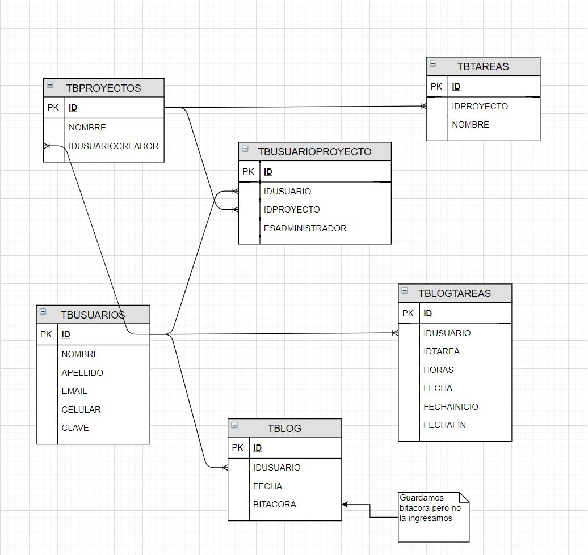
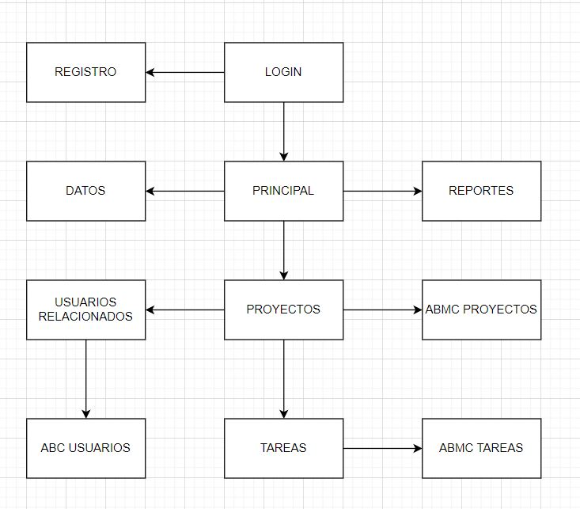
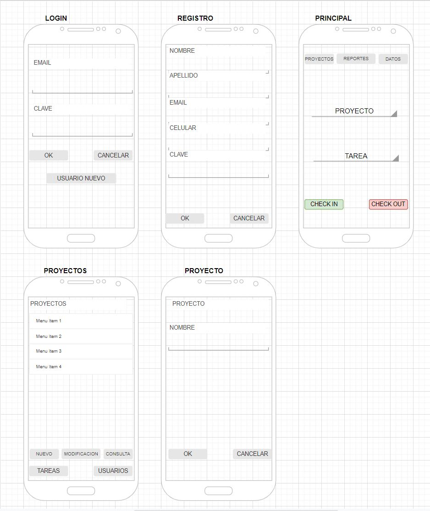
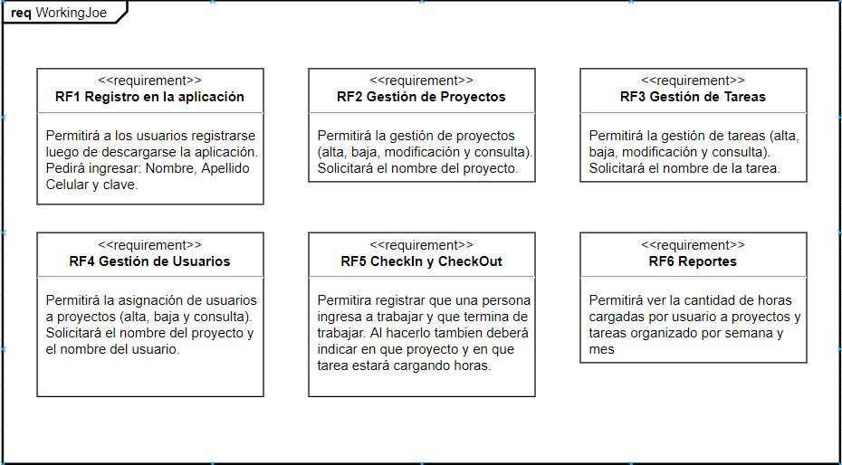

# Working Joe
Se necesita un sistema para gestionar equipos de manera virtual.

Se definirán dos roles para la aplicación: líderes y miembros. Los usuarios líderes deben tener las funcionalidades propias del líder, mientras que para los miembros no deben estar o estar deshabilitadas. Los líderes tienen todas las funcionalidades de los miembros. 

Los líderes definen qué miembros integrarán sus equipos, definen y modifican el proyecto y las tareas a realizar, supervisan a sus miembros y su avance. 

Los miembros de equipos informan cuando empiezan a trabajar en una tarea, cuando finalizan y un detalle de lo realizado. Pueden visualizar a todos los usuarios de la aplicación, quiénes están en línea, visualizar todos los proyectos y solicitar unirse.

La aplicación debe calcular la cantidad de horas que trabaja cada miembro del equipo por semana en cada proyecto, así como también la cantidad de horas totales invertidas en el proyecto. 

Los líderes pueden saber qué cantidad de horas se trabaja por semana y el detalle de las tareas realizadas en cada período de todos los miembros. Cada miembro puede ver sus horas trabajadas y avance semanal propio. 

Para comenzar el proceso, un líder debe crear un proyecto y agregar las tareas que considere necesarias. 

Los miembros pueden buscar los proyectos, ver su descripción y miembros  y solicitar unirse o los líderes pueden agregar personas ya sea en el rol de líder o miembro.

Los líderes también pueden dar de baja a algún miembro del proyecto.

Los líderes pueden aceptar o denegar la solicitud de otros miembros de unirse al proyecto. 

Los miembros cargan su avance al iniciar el cronómetro diciendo en qué tarea colaboran, indicando el inicio de la actividad, el fin y el detalle de lo realizado. Para esto, al indicar el inicio o fin del período de actividad se deberá seleccionar un proyecto de todos los que participa, luego seleccionará una de las tareas predefinidas por el líder y por último seleccionará una subtarea de las definidas por los miembros del equipo. En caso de no haber una subtarea correspondiente, se podrá crear una nueva. 

Cada usuario puede ver si otros usuarios están activos en ese momento. 

La aplicación debe mostrar un cronómetro desde el momento que se inicia un período de actividad hasta que se finaliza (para saber cuánto tiempo se lleva de actividad). Este cronómetro debe permitir el uso completo de la aplicación mientras esté funcionando. 

## DER

## Pantallas

## Requerimiento Funcional

